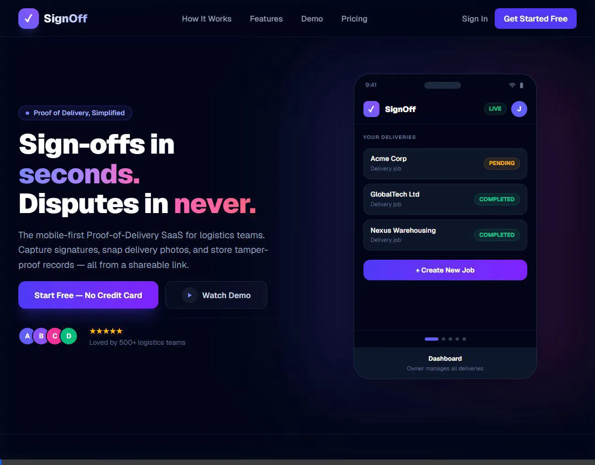

<div align="center">
  
  # ✓ SignOff

  ### Mobile-First, Instant Proof of Delivery
  
  **Disputes in seconds? Never.** Capture signatures, snap delivery photos, and store tamper-proof records — entirely in the web browser. No client apps, no paperwork, no friction.

  🚀 **[Start Free Cloud Version](https://signoff-zeta.vercel.app)** · 📦 **[Self-Host Community Edition](#-quick-start-self-hosting)**

  <br />

  

</div>

---

## ⚡ Features

- **✍️ Digital Signatures:** Recipient signs directly inside the browser using their touch screen. Works instantly on iOS, Android, and tablets.
- **📸 Delivery Photo Proof:** Capture high-fidelity, timestamped proof-of-delivery photos at the drop-off location.
- **🔗 Shareable Job Links:** Dispatch instantly with unique, secure links sent via SMS, WhatsApp, or email.
- **⚡ Real-Time Dashboard:** Track all pending, completed, and deleted jobs inside a premium dark-mode operator panel.
- **🎨 Custom Branding (Premium / Self-Hosted):** Custom business names and logo uploads to white-label the entire sign-off experience.
- **🔒 Secure Records:** Persistent database storage locked to the exact timestamp of sign-off.

---

## 🛠️ The Tech Stack

SignOff is built using modern, lightning-fast tools designed for horizontal scalability:

* **Framework:** Next.js (App Router, Server Actions)
* **Database:** PostgreSQL (Neon serverless driver)
* **Authentication:** NextAuth.js (Passwordless & Credentials flow)
* **File Uploads:** Uploadthing / Cloudinary
* **Styling:** Tailwind CSS
* **Payment Integration:** Stripe (pre-configured) & Maya / GCash (extensible)

---

## 🚀 Quick Start (Self-Hosting)

Follow these steps to run a self-hosted instance of SignOff locally or on your own server.

### 1. Clone the Repository
```bash
git clone https://github.com/yourusername/signoff.git
cd signoff
```

### 2. Install Dependencies
```bash
npm install
```

### 3. Configure Environment Variables
Create a `.env.local` file in the root directory and add the following keys:

```env
# Database (PostgreSQL URL, e.g., Neon.tech)
NEON_DATABASE_URL="your-postgresql-connection-string"

# NextAuth Configuration
NEXTAUTH_URL="http://localhost:3000"
NEXTAUTH_SECRET="generate-a-32-char-random-string"

# Stripe (Optional for hosted payment upgrades)
STRIPE_SECRET_KEY="sk_test_..."
STRIPE_WEBHOOK_SECRET="whsec_..."

# Uploadthing (For storage of photos/signatures)
UPLOADTHING_TOKEN="your-uploadthing-token"
```

### 4. Run Migrations
Run the database migration scripts to initialize the SQL schemas:
```bash
npx tsx scratch_migrate.ts
npx tsx scratch_migrate2.ts
npx tsx scratch_migrate_password.ts
```

### 5. Start Development Server
```bash
npm run dev
```
Open **[http://localhost:3000](http://localhost:3000)** in your browser to view the app!

---

## 🗺️ Roadmap & Contributing

We welcome contributions of all sizes! Whether you want to fix a bug, improve UI aesthetics, or add a new payment gateway, check out our [Contributing Guide](./CONTRIBUTING.md) to get started.

- [ ] Add SMS notification triggers (via Twilio)
- [ ] Implement QR Ph / Maya e-wallet natively
- [ ] Add PDF export for delivery sign-off slips
- [ ] Add multi-language translation layers

---

## 📄 License

Distributed under the **AGPL-3.0 License**. See `LICENSE` for more information.
